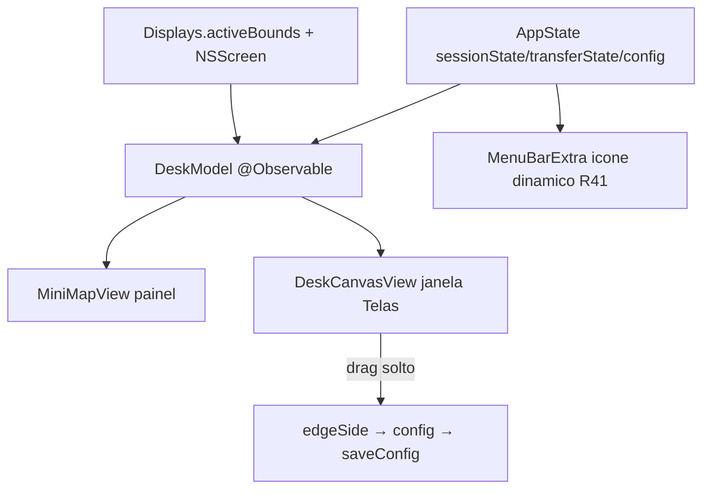

# layout-ux — Design

**Spec**: [spec.md](spec.md)
**Status**: Approved (2026-07-05)
**Mockup interativo**: apresentado na sessão de 2026-07-05 (widget `crossdesk_layout_ux_proposta`)

---

## Pesquisa (2026-07-05)

Cadeia: codebase → docs do projeto → web (Context7 não se aplica — padrões de UX, não API de lib).

| Par | Modelo de layout | Lição para o CrossDesk |
|---|---|---|
| **Universal Control (Apple)** | Zero-config: cursor "empurra" a borda e atravessa; arranjo refinado depois em Ajustes → Monitores (arrastar imagens dos dispositivos) | Padrão-ouro: primeira travessia É o onboarding (R39); arranjo é refinamento posterior, não pré-requisito |
| **Synergy 1 / Deskflow** | Grade fixa 5×3 drag-and-drop | Anti-padrão documentado: quebra com monitor vertical, sobreposição, clientes multi-monitor (issue deskflow#4173 — usuários pedem posição por monitor e não têm) |
| **Synergy 3** | Canvas livre com mover + redimensionar, snapping "com física", overlap permitido | Direção certa, mas o redimensionar existe porque o protocolo deles mapeia geometria absoluta; o nosso §5 (posições normalizadas, cliente contém o próprio cursor) dispensa isso — só posição relativa importa |
| **Mouse Without Borders** | Caixas arrastáveis em linha/grade 2×2, espelha o Ajustes de vídeo do Windows | Reusar o modelo mental do SO é o que torna "fácil de pegar" — no Mac, isso é Ajustes → Monitores |
| **lan-mouse** | Enum de posição por cliente (left/right/top/bottom), lista GTK | É o nosso estado atual (picker). Piso funcional, não diferencial |

Síntese: representação espacial arrastável venceu em todos os pares maduros; a armadilha é acoplar o canvas à geometria real do peer (grade do Synergy 1). O protocolo §5 do CrossDesk já desacopla — o design abraça isso: **telas locais reais + peer abstrato**.

Fontes: [Apple UC](https://support.apple.com/en-us/102459), [Synergy screen editor](https://symless.com/synergy/news/screen-editor-tool-for-synergy-1), [deskflow#4173](https://github.com/deskflow/deskflow/issues/4173), [MWB/PowerToys](https://learn.microsoft.com/en-us/windows/powertoys/mouse-without-borders), [lan-mouse guide](https://deepwiki.com/feschber/lan-mouse/5-user-guide).

## Arquitetura

- **Sem estado novo de domínio**: `DeskModel` é projeção pura de `AppState` + topologia local para geometria de desenho (rects normalizados, slot do peer, fase visual). Testável via `swift test` sem GUI.
- Janela nova: cena `Window("Telas", id: "desk")` no `CrossDeskApp`; `openWindow` a partir do painel. App continua `LSUIElement` (janela não cria Dock icon permanente — `.windowResizability(.contentSize)`).

## Reuso

| Existente | Onde | Uso |
|---|---|---|
| `Displays.activeBounds()` | `Sources/Displays.swift` | topologia local do canvas (já compartilhada server/client) |
| `SessionState` + `statusColor/statusText` | `AppState.swift` | fases visuais R38 — mapeamento 1:1, sem enum novo |
| `TransferUIState` | `AppState.swift` | chip/seta de transferência no mapa |
| `EdgeSide` | `Sources/Protocol/EdgeSide.swift` | contrato do drag (4 slots) |
| `ConfigStore` | `Sources/Config/` | persistir `edgeSide`, flag `firstCrossingDone` (R39) |
| Picker de borda atual | `MenuBarView.swift` | mantido como caminho acessível (R40) |

## Componentes

### DeskModel
- **Purpose**: projetar topologia local + estado da sessão em geometria de desenho (0–1) e fase visual.
- **Location**: `CrossDeskKit/Sources/UI/DeskModel.swift` (novo módulo `UI` no package, sem AppKit pesado — testável).
- **Interfaces**: `monitors: [MonitorTile]` (rect normalizado, `isBuiltin`, nome), `peerSlot(edge:) -> CGRect`, `phase: DeskPhase` (derivada de `SessionState`), `edge(fromDrop point: CGPoint) -> EdgeSide`.
- **Reuses**: `Displays`, `EdgeSide`, `SessionState`.

### DeskCanvasView (janela Telas)
- **Purpose**: canvas R36/R37 — monitores locais, tile do peer com drag/snap, borda ativa, ponto de foco.
- **Location**: `CrossDeskKit/App/DeskCanvasView.swift` + cena em `CrossDeskApp.swift`.
- **Interfaces**: SwiftUI puro; `DragGesture` no tile → `DeskModel.edge(fromDrop:)` → `appState.config.edgeSide` + `saveConfig()`.
- **Dependencies**: `DeskModel`, `AppState` (environment). Cliente: modo somente leitura (R37).

### MiniMapView
- **Purpose**: R35 — versão compacta do mesmo desenho no painel (sem drag; clique → `openWindow("desk")`).
- **Location**: `CrossDeskKit/App/MiniMapView.swift`, inserido no topo de `MenuBarView`.
- **Reuses**: `DeskModel` (mesma projeção, escala menor) — um desenho, dois tamanhos.

### Ícone dinâmico (R41)
- `MenuBarExtra` label troca symbol conforme `sessionState` (`case .controllingRemote` → variante filled/badge). Só `CrossDeskApp.swift`.

### Detecção de laptop
- `CGDisplayIsBuiltin(displayID)` (API pública CoreGraphics) — `Displays` passa a expor `[(rect, isBuiltin, name)]`; nome via `NSScreen.localizedName` (macOS 10.15+). Sem API nova/privada.

## Fases visuais (R38)

`DeskPhase` derivada (não armazenada): `empty` (stopped), `pairing` (waitingPeer && !paired), `armed` (waitingPeer && paired), `localFocus` (connected), `remoteFocus` (controllingRemote), `error(msg)`. Transferência é camada ortogonal (overlay do chip/seta a partir de `TransferUIState`).

Transição `localFocus ↔ remoteFocus`: animação curta do ponto de foco atravessando a borda (SwiftUI `withAnimation`, ~400 ms) — o "empurrar" do Universal Control como feedback, não como física real.

## Cliente: borda de retorno

Cliente não escolhe borda (protocolo: borda de entrada do ENTER = borda de retorno). `ClientSession` já conhece a última borda de entrada → expor `lastEnterEdge: EdgeSide?` no estado publicado; canvas do cliente posiciona o tile do servidor nela, somente leitura, legenda "definido pelo servidor". Se nunca houve ENTER, tile fica no lado oposto ao default do servidor? Não — **incerteza resolvida de forma honesta**: sem ENTER ainda, tile em posição neutra com legenda "aparece após a primeira travessia".

## Error handling

| Cenário | Tratamento | Usuário vê |
|---|---|---|
| Monitor conectado/removido com janela aberta | `NSApplication.didChangeScreenParametersNotification` → `DeskModel` recalcula | canvas se reorganiza animado |
| Drop ambíguo (canto) | maior distância projetada decide; empate → mantém borda atual | snap sempre em um dos 4 lados, nunca estado inválido |
| Sessão rodando ao mudar borda | igual hoje: mudança gravada, aplicada no próximo start (`edgeSide` é lido no `ServerSession.init`) | aviso discreto "aplica ao reiniciar a sessão" |
| Janela aberta sem pareamento | fase `empty/pairing` com CTA | nunca canvas quebrado |

## Decisões (não-óbvias)

| Decisão | Escolha | Racional |
|---|---|---|
| Onde vive o editor | Janela dedicada, painel ganha só mini-mapa | Popover 320 pt não comporta canvas manipulável; modelo Apple (Control Center = glance, Ajustes = arranjo). Painel continua sendo o centro de comando rápido |
| Peer no canvas | Tile abstrato 16:10 | Protocolo §5 é ativo, não limitação: cada lado organiza as próprias telas; evita a armadilha da grade do Synergy 1 e o problema deskflow#4173 por construção |
| Picker de borda | Mantido no painel | A11y (R40) + paridade: canvas é enhancement, nunca único caminho |
| Redimensionar tiles | Não | Sem geometria absoluta no fio, tamanho não significa nada; menos é mais (Synergy 3 precisa, nós não) |
| Módulo UI no package | `Sources/UI/` com lógica de projeção pura | Mantém padrão do projeto: `swift test` cobre snap/fases sem GUI |

## Incertezas

- `CGDisplayIsBuiltin` + `NSScreen.localizedName` verificados como APIs públicas conhecidas; mapeamento `CGDirectDisplayID ↔ NSScreen` via `deviceDescription["NSScreenNumber"]` — padrão consolidado, confirmar no primeiro task de implementação (risco baixo).
- Animação de travessia no mini-mapa dentro de `MenuBarExtra` (popover pode reciclar a view) — validar cedo; fallback: transição sem animação (funcionalidade idêntica).
